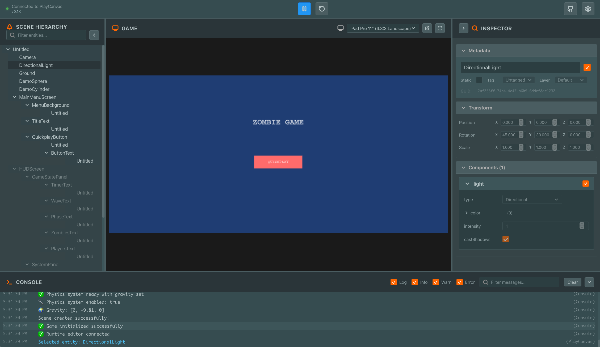

# PlayCanvas Runtime Editor

A clean, modern React-based runtime editor for PlayCanvas games. This tool provides real-time debugging and inspection capabilities for PlayCanvas applications during development.



## Features

### 🎮 Game Integration
- **Live Connection**: Seamlessly connects to PlayCanvas games via iframe
- **Real-time Updates**: Hierarchy and property updates via polling
- **Cross-origin Support**: Works with games hosted on different domains

### 🌲 Entity Hierarchy
- **Tree View**: Navigate your scene hierarchy with expandable nodes
- **Search & Filter**: Quickly find entities by name or tags
- **Visual Indicators**: See enabled/disabled states and entity tags
- **Selection Sync**: Click to select entities and view their properties

### 🔍 Property Inspector
- **Entity Details**: View name, enabled state, GUID, and tags
- **Transform Data**: Inspect position, rotation, and scale values
- **Component Properties**: Explore all component data with type-aware rendering
- **Unity-style UI**: Familiar interface for game developers

### 🎛️ Game Controls
- **Play/Pause**: Control game execution
- **Reload**: Refresh the game iframe
- **Fullscreen**: Enter fullscreen mode for testing
- **Aspect Ratios**: Test different screen ratios (16:9, 4:3, 1:1, free)

### 📊 Console
- **Real-time Logs**: View game console messages as they happen
- **Message Filtering**: Filter by log type (error, warn, info, log)
- **Search**: Find specific messages quickly
- **Auto-scroll**: Automatically scroll to latest messages

## Quick Start

1. **Copy and paste `src/playcanvas-debug-integration.js` into the root of your game.**
   

1. **Start PlayCanvas Game as Usual**
   
   Typically `npm run dev`

2. **Install Dependencies**
   ```bash
   npm install
   ```

3. **Start PlayCanvas Runtime Editor Server**
   ```bash
   npm start
   ```

4. **Open Web App at URL**
   
   Typically `http://localhost:3000`.

5. **Enter Game URL and Press Save**

## Game Integration

To connect your PlayCanvas game to the runtime editor, copy and paste the debug integration script from this repository into the root of your game.`:

```html
<script src="playcanvas-debug-integration.js"></script>
```

The script automatically establishes communication with the runtime editor when both are running.