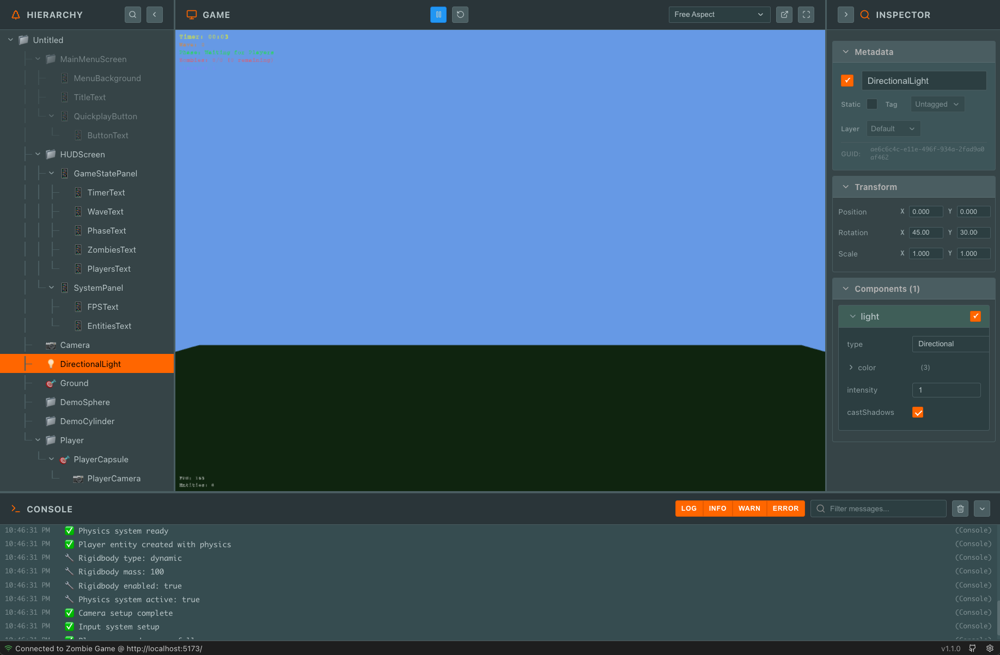

# PlayCanvas Runtime Editor

A clean, modern React-based runtime editor for PlayCanvas games. This tool provides real-time debugging and inspection capabilities for PlayCanvas applications during development.



## Features

### 🎮 Game Integration
- **Live Connection**: Seamlessly connects to PlayCanvas games via iframe
- **Real-time Updates**: Instant hierarchy and property updates
- **Cross-origin Support**: Works with games hosted on different domains

### 🌲 Entity Hierarchy
- **Tree View**: Navigate your scene hierarchy with expandable nodes
- **Search & Filter**: Quickly find entities by name or tags
- **Visual Indicators**: See enabled/disabled states and entity tags
- **Selection Sync**: Click to select entities and view their properties

### 🔍 Property Inspector
- **Entity Details**: View name, enabled state, GUID, and tags
- **Transform Data**: Inspect position, rotation, and scale values
- **Component Properties**: Explore all component data with type-aware rendering
- **Unity-style UI**: Familiar interface for game developers

### 🎛️ Game Controls
- **Play/Pause**: Control game execution
- **Reload**: Refresh the game iframe
- **Fullscreen**: Enter fullscreen mode for testing
- **Aspect Ratios**: Test different screen ratios (16:9, 4:3, 1:1, free)

### 📊 Console
- **Real-time Logs**: View game console messages as they happen
- **Message Filtering**: Filter by log type (error, warn, info, log)
- **Search**: Find specific messages quickly
- **Auto-scroll**: Automatically scroll to latest messages

### ⚙️ Settings
- **Log Levels**: Control verbosity (none, error, warn, info, debug)
- **Persistent Settings**: Automatically save preferences
- **Reset Options**: Restore default settings

## Quick Start

1. **Install Dependencies**
   ```bash
   npm install
   ```

2. **Start Development Server**
   ```bash
   npm start
   ```

3. **Build for Production**
   ```bash
   npm run build
   ```

## Project Structure

```
src/
├── App.tsx                 # Main application component
├── App.css                 # All styling in one file
├── DiagnosticPanel.tsx     # Settings panel component
├── Logger.ts               # Simple logging utility
├── PropertyInspectors.tsx  # Property rendering components
├── PlayCanvasDebugBridge.ts # Game communication bridge
└── index.tsx              # Application entry point
```

## Game Integration

To connect your PlayCanvas game to the runtime editor, copy and paste the debug integration script from this repository into the root of your game. Reference the script below where you reference your game's canvas. Ensure your game is accessible at `http://localhost:5173/`:

```html
<script src="playcanvas-debug-integration.js"></script>
```

The script automatically establishes communication with the runtime editor when both are running.

## Configuration

### Aspect Ratios
- **Free**: Responsive layout
- **16:9**: Standard widescreen
- **4:3**: Traditional monitor ratio
- **1:1**: Square viewport

### Logging Levels
- **None**: No logging output
- **Error**: Only error messages
- **Warn**: Errors and warnings
- **Info**: Errors, warnings, and info
- **Debug**: All messages including debug info

## Development

The runtime editor is built with:
- **React 18** with TypeScript
- **Lucide React** for icons
- **React Resizable Panels** for layout
- **Modern CSS** with custom properties

### Key Design Principles
- **Simplicity**: Clean, focused codebase without unnecessary complexity
- **Performance**: Efficient rendering and minimal re-renders
- **Accessibility**: Keyboard navigation and screen reader support
- **Responsiveness**: Works on different screen sizes

## Browser Support

- Chrome 90+
- Firefox 88+
- Safari 14+
- Edge 90+

## License

MIT License - see LICENSE file for details.

## Contributing

1. Fork the repository
2. Create a feature branch
3. Make your changes
4. Add tests if applicable
5. Submit a pull request

For bugs and feature requests, please open an issue on GitHub.
